# ASTER

## Generated Test Cases

`python` and `java` directories contains the generated test cases by EvoSuite, CodaMOSA, and ASTER (CodeLlama 34b, GPT4o, Granite 8b, Granite 34b, Llama 8b, and Llama 70b)

## CodaMOSA

We changed the model from `davinci002` to `GPT-3.5-turbo-instruct` as recommended in the OpenAI website. We tried to use `GPT-4o` as it is the latest model, but CodaMOSA crashed with the model, so we failed to use the model. The source code is available in the `codamosa` directory.

## Figures

### Motivation
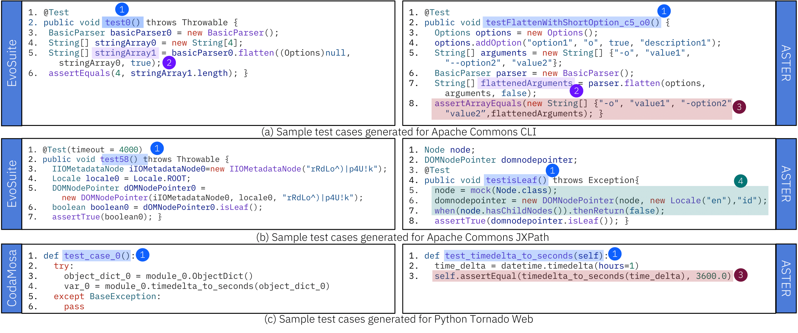

Fig. 1: Illustration of naturalness (in terms of test names, variable names, and assertions) and mocking in test cases generated by the
LLM-assisted technique of ASTER (right) compared with tests generated by EvoSuite [11] and CodaMosa [33] (left).

### Overview
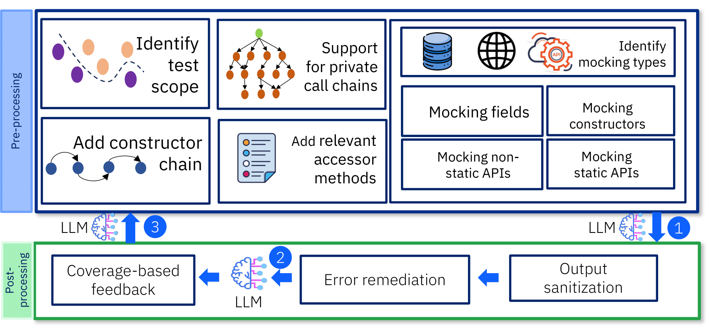

Fig. 2: Overview of ASTER. 1⃝, 2⃝, 3⃝ represent test-generation, test-repair, and coverage-augmentation prompts.

### Prompts
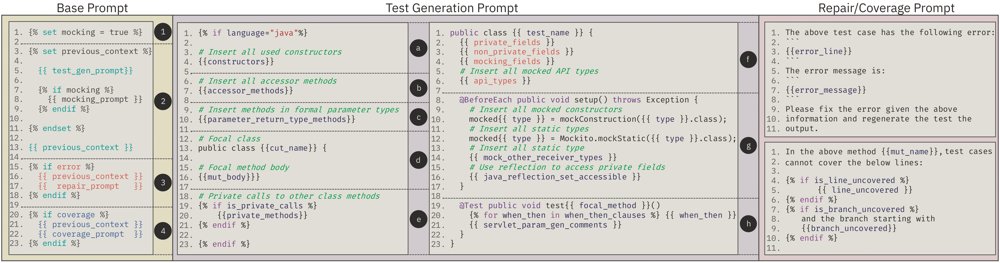

Fig. 3: Templates for composing prompts for test generation, test repair, and coverage augmentation.

### Achieved Code Coverage on Java SE applications

  

    <figure>
      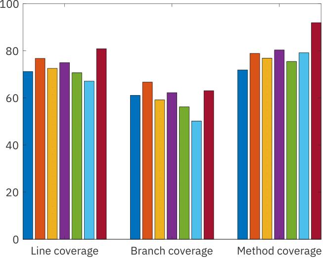
      <figcaption>Commons CLI</figcaption>
    </figure>
  

  

    <figure>
      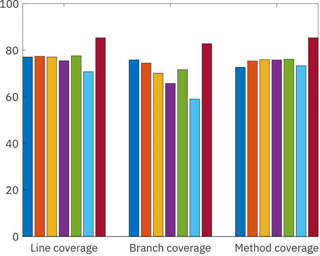
      <figcaption>Commons Codec</figcaption>
    </figure>
  

  

    <figure>
      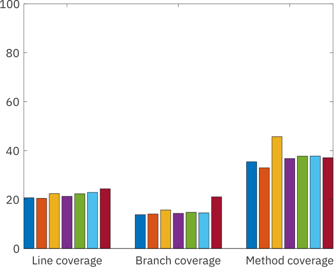
      <figcaption>Commons Compress</figcaption>
    </figure>
  

  

    <figure>
      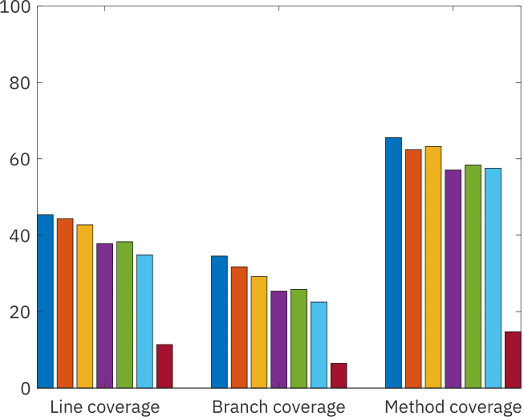
      <figcaption>Commons JXPath</figcaption>
    </figure>
  

Fig. 4: Line, branch, and method coverage achieved on Java SE applications by ASTER (configured with different LLMs) and EvoSuite.

### Achieved Code Coverage on Java EE applications

  

    <figure>
      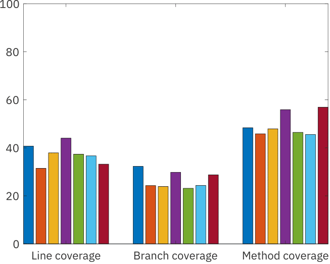
      <figcaption>CargoTracker</figcaption>
    </figure>
  

  

    <figure>
      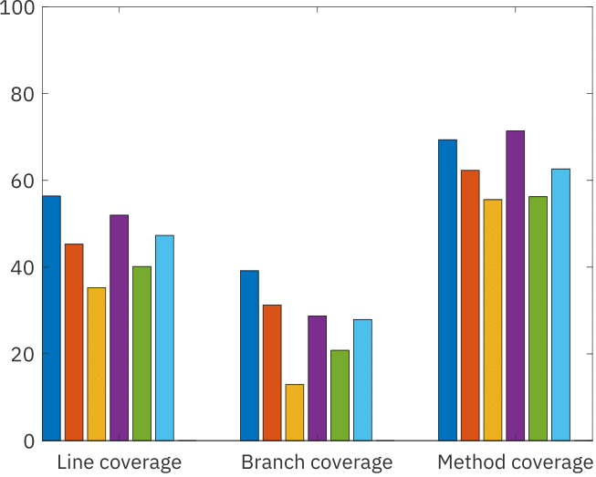
      <figcaption>PetClinic</figcaption>
    </figure>
  

  

    <figure>
      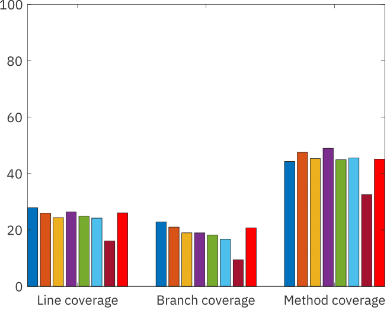
      <figcaption>DayTrader</figcaption>
    </figure>
  

  

    <figure>
      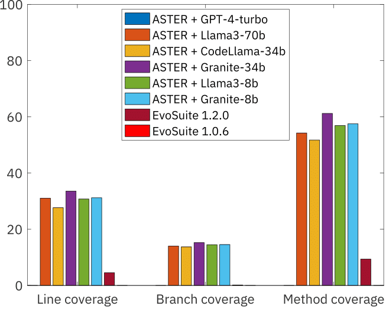
      <figcaption>App X</figcaption>
    </figure>
  

Fig. 4: Line, branch, and method coverage achieved on Java EE applications by ASTER (configured with different LLMs) and EvoSuite (GPT-4 run excluded for App X for confidentiality reasons).

### Python
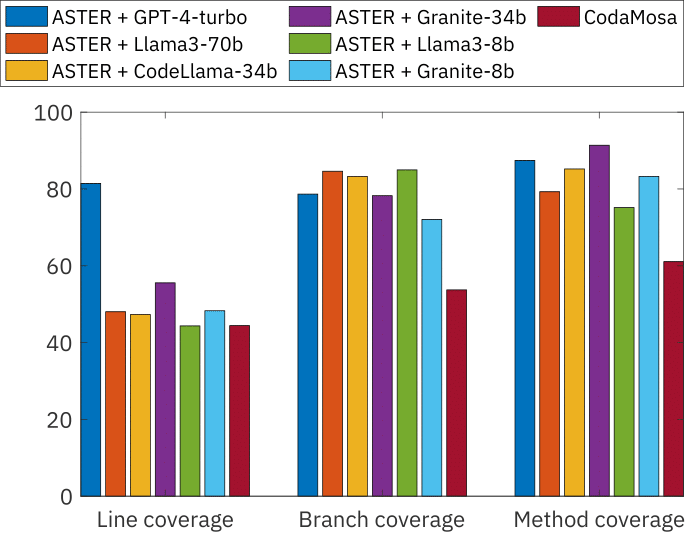

Fig. 5: Line, branch, and method coverage achieved on Python  projects by ASTER (with different LLMs) and CodaMosa.

### Java Naturalness
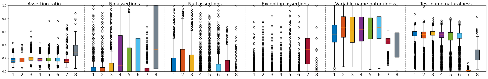

Fig. 6: Naturalness metrics for Java SE and EE applications (1: GPT-4, 2: Llama3-70b, 3: CodeLlama-34b, 4: Granite-34b, 5: Llama-8b, 6: Granite-8b, 7: EvoSuite, 8: Developer).

### Python Naturalness
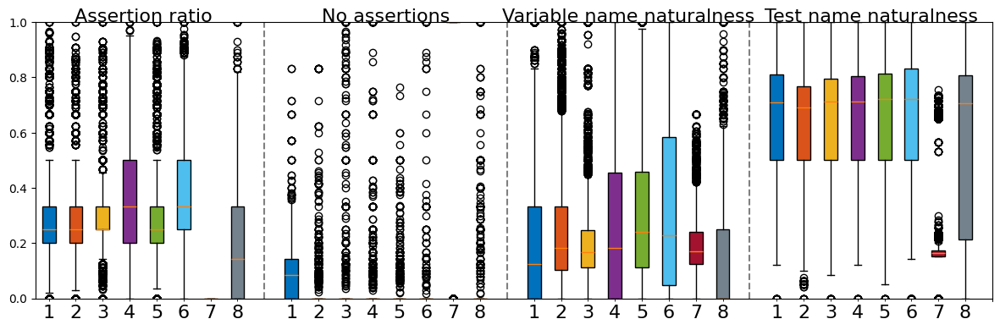

Naturalness metrics for Python applications (1: GPT-4, 2: Llama3-70b, 3: CodeLlama-34b, 4: Granite-34b, 5: Llama-8b, 6: Granite-8b, 7: CodaMOSA, 8: Developer).

### Survey-Java
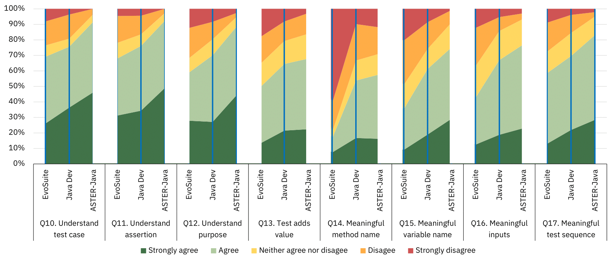

Fig. 7: Survey responses on test quality (Q10–Q17) for Java test cases.

### Survey response on Q18
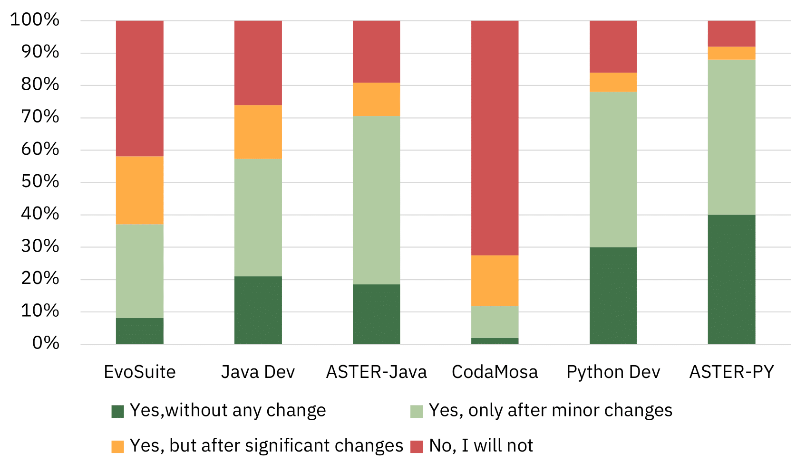

Fig. 8: Survey response on Q18 (whether developers would add such test cases to their test suites).

### Survey questions
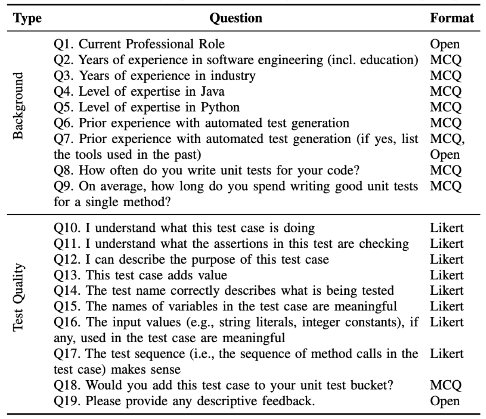

Fig. 9: Survey questions categorized into two groups.
